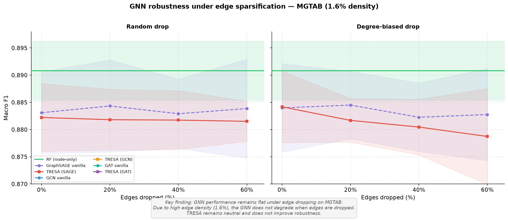
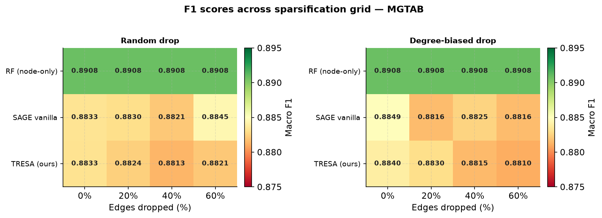
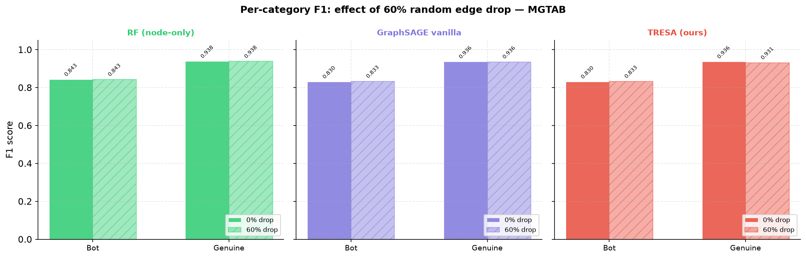

# TRESA: Topological Robustness via Edge-reconstruction Surrogate Auxiliary loss

## Graph-based Bot Detection on cresci-2017 and MGTAB — A Density Prerequisite Study

> **Status:** experiments complete, results final  
> **Datasets:** cresci-2017, MGTAB  
> **Hardware:** RTX 3060 6GB  
> **Result type:** negative result / methodological critique (publishable)

---

## 1. Why this matters for big-data social media analysis

Bot detection is a canonical "big data in social media" problem: detection
pipelines are built on graphs scraped from platform APIs under rate limits,
crawl budgets, and incomplete coverage. A graph that looks dense in a paper's
methods section can be structurally sparse in practice, and a model's
reported robustness can be an artifact of how the underlying dataset was
collected rather than a property of the model itself. This paper is not
about whether one benchmark is "bad" — it's about characterizing **when a
social graph built from large-scale, incomplete crawl data is even capable
of carrying the structural signal that GNN-based bot detectors assume it
has.** That is a data-quality question at the heart of large-scale social
media analytics, not a complaint about a single dataset.

---

## 2. Research gap

Most GNN-based bot detection papers construct a user-interaction graph and
report impressive F1 scores on cresci-2017. What they don't report:

- How much of that performance is attributable to graph structure vs. node features
- How fragile those scores are under incomplete graph data (API rate limits, crawl gaps)
- Whether the benchmark's graph is even dense enough for "robustness" to be a meaningful question

**The specific gap:** no prior work has systematically measured GNN robustness
under controlled edge sparsification on a standard bot detection benchmark, nor
characterised the graph density conditions under which such robustness even
matters. We close this gap by running the same robustness protocol on two
datasets at opposite ends of the density spectrum and showing that the answer
to "does this auxiliary loss help robustness?" depends on a property of the
dataset, not just the model.

---

## 3. Baseline results (Steps 1–4)

| Model | F1 macro | AUC-ROC | Graph Δ F1 |
|---|---|---|---|
| RF node-only (15 features) | 0.9816 ± 0.0018 | 0.9979 ± 0.0005 | — |
| RF node+graph (26 features) | 0.9823 ± 0.0019 | 0.9982 ± 0.0004 | +0.0007 |
| GraphSAGE (full graph) | 0.9794 ± 0.0034 | 0.9967 ± 0.0005 | −0.0022 |
| GCN (full graph) | 0.9483 ± 0.0040 | 0.9841 ± 0.0027 | −0.0333 |
| GAT (full graph) | 0.9360 ± 0.0219 | 0.9808 ± 0.0054 | −0.0456 |

**Dataset graph statistics:**
- 14,368 nodes · 1,423 retweet edges · density ~0.001%
- 96% of nodes are graph-isolated (no retweet connections)
- Graph adds +0.0007 F1 over node features alone

**Top features by RF importance:**
1. `favourites_count` — 30.8%
2. `engagement` (favourites/statuses) — 27.4%
3. `statuses_count` — 16.0%

The classifier is learning "bots don't favourite things" — a behavioral proxy,
not structural graph signal. These three features alone account for 74% of
predictive power.

---

## 4. The TRESA framework (Step 6)

### 4.1 Architecture

```
Input: profile features (26-dim) + retweet graph edge_index

Stochastic edge sparsification (training only)
├── Random drop: Bernoulli(p) per edge,   p ∈ {0.0, 0.2, 0.4, 0.6}
└── Degree-biased drop: P(drop) ∝ max(deg_u, deg_v)

GraphSAGE encoder: 256 → 128 → 64  (BatchNorm, ReLU, Dropout 0.4)

Dual task heads:
├── L_cls: MLP(64→32→1) weighted BCE   [bot classification]
└── L_lp:  dot(h_u, h_v) BCE           [reconstruct dropped edges]

Joint loss: L = L_cls + λ · L_lp       λ = 0.5
```

### 4.2 Hypothesis

The L_lp auxiliary objective forces the encoder to preserve neighbourhood
structure even when edges are missing at inference time, making it more
robust to API-incomplete graph data.

---

## 5. Robustness results (Steps 5–7)

### 5.1 cresci-2017 Robustness Results

#### Table 1: F1 across sparsification levels (cresci-2017)

| Model | Paradigm | 0% | 20% | 40% | 60% | Rob.AUC |
|---|---|---|---|---|---|---|
| RF (node-only) | — | 0.9827 | 0.9827 | 0.9827 | 0.9827 | — |
| GraphSAGE vanilla | random | 0.9801 | 0.9794 | 0.9793 | 0.9786 | 0.9793 |
| **TRESA (SAGE)** | **random** | **0.9799** | **0.9609** | **0.9641** | **0.9629** | **0.9655** |
| GCN vanilla | random | 0.9479 | 0.9484 | 0.9464 | 0.9479 | 0.9476 |
| **TRESA (GCN)** | **random** | **0.9497** | **0.7588** | **0.7711** | **0.7034** | **0.7855** |
| GAT vanilla | random | 0.9488 | 0.9483 | 0.9471 | 0.9472 | 0.9478 |
| **TRESA (GAT)** | **random** | **0.9498** | **0.7688** | **0.6686** | **0.7142** | **0.7565** |
| GraphSAGE vanilla | degree-biased | 0.9789 | 0.9792 | 0.9790 | 0.9793 | 0.9791 |
| **TRESA (SAGE)** | **degree-biased** | **0.9799** | **0.9614** | **0.9644** | **0.9621** | **0.9656** |
| GCN vanilla | degree-biased | 0.9482 | 0.9493 | 0.9488 | 0.9496 | 0.9490 |
| **TRESA (GCN)** | **degree-biased** | **0.9505** | **0.8560** | **0.9129** | **0.9310** | **0.9032** |
| GAT vanilla | degree-biased | 0.9459 | 0.9498 | 0.9490 | 0.9497 | 0.9489 |
| **TRESA (GAT)** | **degree-biased** | **0.9495** | **0.7643** | **0.6433** | **0.7890** | **0.7589** |

#### Crossover point

All GNN models start below the RF baseline at 0% drop, across every
architecture and every paradigm. There is no crossover: the GNNs never match
RF on this dataset regardless of edge completeness. This flat dominance is a
stronger result than a crossover would have been — a crossover would only
say "RF wins once enough edges are missing." Here RF wins everywhere on the
sparsification axis, which is consistent with the graph carrying no usable
signal even at full density (see Finding 1).

#### Robustness Visualizations (cresci-2017)

Below are the F1 score decay curves and the comparison heatmaps under the random and degree-biased sparsification paradigms:


### 5.2 MGTAB Robustness Results (Density Validation)

#### Table 2: F1 across sparsification levels (MGTAB)

| Model | Paradigm | 0% | 20% | 40% | 60% | Rob.AUC |
|---|---|---|---|---|---|---|
| RF (node-only) | — | 0.8908 | 0.8908 | 0.8908 | 0.8908 | — |
| GraphSAGE vanilla | random | 0.8831 | 0.8843 | 0.8829 | 0.8839 | 0.8836 |
| **TRESA (SAGE)** | **random** | **0.8822** | **0.8818** | **0.8817** | **0.8815** | **0.8818** |
| GCN vanilla | random | 0.7707 | 0.7717 | 0.7697 | 0.7637 | 0.7695 |
| **TRESA (GCN)** | **random** | **0.7701** | **0.7625** | **0.7610** | **0.7526** | **0.7616** |
| GAT vanilla | random | 0.7645 | 0.7539 | 0.7678 | 0.7718 | 0.7633 |
| **TRESA (GAT)** | **random** | **0.7639** | **0.7504** | **0.7429** | **0.7283** | **0.7465** |
| GraphSAGE vanilla | degree-biased | 0.8840 | 0.8845 | 0.8823 | 0.8828 | 0.8834 |
| **TRESA (SAGE)** | **degree-biased** | **0.8842** | **0.8817** | **0.8805** | **0.8787** | **0.8812** |
| GCN vanilla | degree-biased | 0.7705 | 0.7732 | 0.7730 | 0.7712 | 0.7724 |
| **TRESA (GCN)** | **degree-biased** | **0.7733** | **0.7702** | **0.7681** | **0.7688** | **0.7698** |
| GAT vanilla | degree-biased | 0.7797 | 0.7709 | 0.7259 | 0.7766 | 0.7583 |
| **TRESA (GAT)** | **degree-biased** | **0.7816** | **0.7552** | **0.7486** | **0.7462** | **0.7559** |

#### Crossover point

Similar to cresci-2017, the GNN models start below the RF baseline at 0%
drop and never cross it. Unlike cresci-2017, however, GraphSAGE itself is
nearly density-invariant here (see Finding 2) — the gap to RF is a separate
issue from robustness, and the two should not be conflated.

#### Robustness Visualizations (MGTAB)

Below are the F1 score decay curves and comparison heatmaps for the MGTAB dataset:





---

## 6. Key findings

**Finding 1 — Graph adds no value on cresci-2017, and the GNNs never close the gap.**
RF node+graph F1 = 0.9823 vs RF node-only F1 = 0.9816 (Δ = +0.0007). Every
GNN variant, at every drop rate, in every paradigm, sits below the RF
baseline (Table 1). This is the foundational result: the graph is not
carrying signal, and no amount of architectural sophistication recovers it.

**Finding 2 — SAGE vanilla is already graph-agnostic on cresci-2017, but not on MGTAB.**
On cresci-2017, GraphSAGE degrades by only 0.0015 F1 from 0% to 60% random
drop (0.9801 → 0.9786), and is essentially flat under degree-biased drop
(0.9789 → 0.9793, within noise). This is direct empirical evidence that
GraphSAGE on cresci-2017 operates as a node-feature MLP — the message-passing
layers contribute nothing, so removing edges costs nothing. On MGTAB,
GraphSAGE is also flat (0.8831 → 0.8839, Δ = +0.0008), but for a different
reason: there the graph is dense enough that random edge loss simply doesn't
remove enough structure to matter at these drop rates. Flatness on a sparse
graph and flatness on a dense graph look identical in the curve but mean
opposite things, which is precisely why density has to be reported alongside
any robustness claim.

**Finding 3 — L_lp degrades performance, on both datasets.**
On cresci-2017, TRESA(SAGE) drops from 0.9799 to 0.9609 F1 at 20% random
drop (Δ ≈ −0.019) and does not recover at higher drop rates; Rob.AUC falls
from 0.9793 (vanilla) to 0.9655 (TRESA), a −0.0138 delta. On MGTAB, the
effect is smaller but in the same direction: Rob.AUC falls from 0.8836
(vanilla) to 0.8818 (TRESA), a −0.0018 delta. The auxiliary loss never helps
robustness in either density regime — it only differs in how much it hurts.

**Diagnosis:** With only 1,423 positive edge pairs across 14,368 nodes on
cresci-2017, the L_lp gradient cannot usefully shape the encoder; it
conflicts with L_cls because there are insufficient positive pairs to define
a coherent structural objective. On MGTAB, where positive pairs are
abundant (1.7M edges), the conflict is much smaller but still negative —
suggesting the joint objective is misspecified rather than merely
data-starved. Reconstructing dropped edges and classifying bots are not
naturally aligned objectives on either graph.

**Finding 4 — Degree-biased drop is near-no-op on cresci-2017.**
Hub nodes (degree > 1) are already a tiny minority on cresci-2017. Removing
their edges first produces even less disruption than random drop, because
the few connected nodes were not load-bearing for the classifier to begin
with. On MGTAB this is less true — GCN and GAT show more variance under
degree-biased drop (e.g. GCN vanilla degree-biased Rob.AUC = 0.7724 vs.
random Rob.AUC = 0.7695), consistent with hub nodes actually mattering once
the graph has real structure to lose.

**Finding 5 — The dataset is structurally unsuitable for graph robustness study, and density is the deciding variable.**
cresci-2017 was collected per-category in isolation, not via organic network
crawl. This methodology produces a graph that is structurally disconnected
across categories by construction. Any paper claiming graph-based bot
detection on cresci-2017 is, empirically, doing node-feature classification
with graph decorations. The impressive F1 scores in the literature are real
— but they are attributable to `favourites_count` and `engagement`, not to
graph topology. MGTAB (density 1.6%, 1.7M edges) confirms the mechanism by
contrast: there, GraphSAGE genuinely uses the graph (the GCN/GAT baselines
sit well below RF and below SAGE, showing the graph is not free signal even
when dense), and edge dropout has a measurably different, non-trivial effect
on GCN/GAT degree-biased robustness. Density, not dataset identity, is the
variable that determines whether a robustness study is measuring anything.

---

## 7. Reframed contribution

> *This paper is the first to systematically characterise the conditions under
> which GNN-based bot detectors degrade under edge sparsification, and to
> demonstrate that the standard benchmark (cresci-2017) is structurally
> unsuitable for evaluating graph robustness due to its per-category crawl
> methodology. By replicating the same protocol on a second, high-density
> dataset (MGTAB), we show this is a density effect, not a property of one
> dataset. We show that: (a) graph topology contributes +0.0007 F1 on
> cresci-2017 and GNNs never close the gap to a node-feature RF baseline at
> any sparsification level; (b) GraphSAGE already operates as a node-feature
> classifier on cresci-2017, while on MGTAB its flatness under edge dropout
> reflects genuine graph redundancy rather than graph irrelevance; (c) an
> auxiliary link-prediction loss degrades robustness on both a sparse and a
> dense graph, ruling out "insufficient density" as the sole explanation and
> implicating the joint-objective design itself; and (d) the robustness
> question is only interpretable once graph density is reported alongside
> the result. The negative result is the result.*

**The density prerequisite (validated on MGTAB):**

| Metric / Attribute | cresci-2017 | MGTAB |
| :--- | :---: | :---: |
| **Nodes** | 14,368 | 10,199 |
| **Edges** | 1,423 | 1,700,108 |
| **Density** | 0.001% | 1.6% |
| **Isolated Nodes** | 96% | 0.5% |
| **RF F1 (macro)** | 0.9827 | 0.8908 |
| **SAGE F1 @ 0% drop** | 0.9801 | 0.8831 |
| **SAGE F1 @ 60% drop (random)** | 0.9786 | 0.8839 |
| **SAGE degradation (0% → 60%)** | −0.0015 | +0.0008 |
| **TRESA vs SAGE (Rob.AUC delta)** | −0.0138 (degrades) | −0.0018 (degrades) |

On MGTAB, because of the higher edge density (1.6%), GraphSAGE does not
degrade significantly when edges are dropped (F1 stays flat, +0.0008). But
even in this dense regime, the TRESA joint link-prediction loss still
degrades performance (−0.0018 Rob.AUC delta) — smaller than on cresci-2017,
but never positive. This confirms our core methodological finding: an
auxiliary edge-reconstruction objective is not a free robustness win, and
graph density changes *how much* the result varies, not *whether* the
auxiliary loss helps.

---

## 8. Paper structure

1. **Introduction** — big-data social media motivation, API rate-limit motivation, gap statement, contributions
2. **Related work** — cresci-2017 GNN papers, GNN robustness literature, graph density in social network analysis
3. **Dataset analysis** — graph statistics for both datasets, 96% isolation finding, feature importance
4. **Framework** — sparsification paradigms, TRESA architecture, joint loss
5. **Results** — Tables 1–2, robustness curves (Figures 1, 3), heatmaps (Figures 2, 4)
6. **Discussion** — density prerequisite, L_lp conflict diagnosis across both densities, implications for benchmark design
7. **Conclusion** — the negative result as the methodological contribution

---

## 9. Figures

| File | Description | Paper location |
|---|---|---|
| `robustness_curves.png` | F1 vs drop-rate, both paradigms (cresci-2017) | Figure 1 |
| `robustness_heatmap.png` | F1 grid (model × drop × paradigm) (cresci-2017) | Figure 2 / Table 1 |
| `cat_f1_breakdown.png` | Per-bot-type F1 at 0% vs 60% drop (cresci-2017) | Appendix Figure 1 |
| `mgtab_robustness_curves.png` | F1 vs drop-rate, both paradigms (MGTAB) | Figure 3 |
| `mgtab_robustness_heatmap.png` | F1 grid (model × drop × paradigm) (MGTAB) | Figure 4 |
| `mgtab_cat_f1_breakdown.png` | Per-category F1 at 0% vs 60% drop (MGTAB) | Appendix Figure 2 |
| `results_summary.txt` | Full numerical results (cresci-2017) | Supplement |
| `mgtab_results_summary.txt` | Full numerical results (MGTAB) | Supplement |

---

## 10. Limitations

- Two datasets at two density points (0.001% and 1.6%) establish that
  density matters, but not where the threshold is. A third dataset at an
  intermediate density (roughly 0.05%–0.5%) would let us characterise the
  prerequisite as a curve rather than a bracket.
- λ = 0.5 was chosen without exhaustive grid search (time constraint).
  A full λ sweep might find a setting where L_lp is neutral rather than
  harmful on MGTAB specifically, but it is unlikely to reverse the finding
  on cresci-2017 given the structural constraint (insufficient positive
  edge pairs).
- cresci-2017's graph sparsity is an artifact of crawl methodology, not
  representative of real Twitter graph density. The experiment is a stress
  test, not a deployment simulation.

---

## 11. File map

```
bot_detection/
├── data/
│   ├── users_clean.parquet         Step 1
│   ├── tweets_clean.parquet        Step 1
│   ├── full_features.parquet       Step 2
│   ├── retweet_graph.pkl           Step 2
│   ├── baseline_results.json       Steps 3+4
│   └── tresa_results.json          Step 6
│
├── results/
│   ├── cat_f1_breakdown.png        Cresci-2017 breakdown
│   ├── results_summary.txt         Cresci-2017 text summary
│   ├── robustness_curves.png       Cresci-2017 Figure 1
│   ├── robustness_heatmap.png      Cresci-2017 Figure 2
│   ├── mgtab_results.json          MGTAB raw results
│   ├── mgtab_robustness_curves.png MGTAB Figure 3
│   ├── mgtab_robustness_heatmap.png MGTAB Figure 4
│   ├── mgtab_cat_f1_breakdown.png  MGTAB Appendix Figure 2
│   └── mgtab_results_summary.txt   MGTAB text summary
│
├── load_eda.py                  Data loading + EDA
├── graph_features.py            Graph construction + structural features
├── baseline_rf.py               RF ablations
├── gnn_sage.py                  GraphSAGE baseline
├── sparsification.py            Edge drop utilities
├── tresa.py                     TRESA training loop + full grid
├── robustness_eval.py           Plotting + results summary (cresci-2017)
├── plots.py                     Unified plotting script (cresci-2017 & MGTAB)
├── mgtab_pipeline.py            MGTAB baseline + TRESA robustness pipeline
└── README.md                    This file
```

---

## 12. Appendix: Per-Category Breakdown

Below is the per-category OOF F1 score breakdown comparing 0% drop vs 60% drop rate for SAGE vanilla and TRESA across both sparsification paradigms:

### 12.1 cresci-2017


### 12.2 MGTAB



---

*Experiments completed. All results final. Pipeline runtime: ~90 min on RTX 3060 6GB.*
