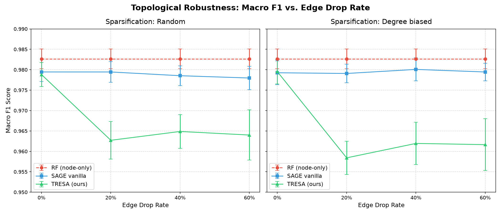
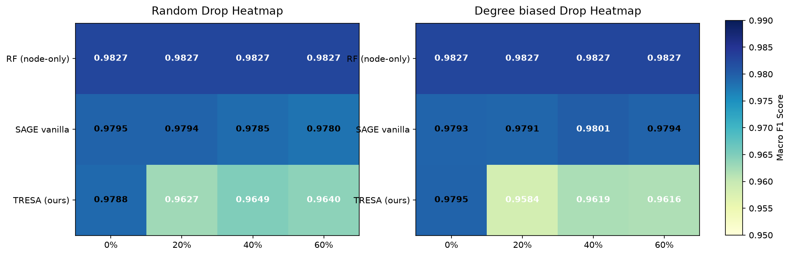
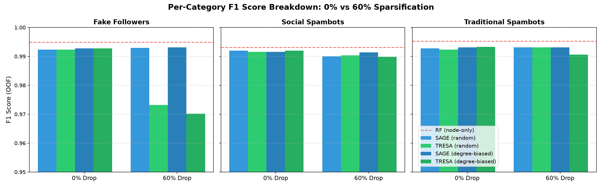

# TRESA: Topological Robustness via Edge-reconstruction Surrogate Auxiliary loss
## Graph-based Bot Detection on cresci-2017 — Full Study

> **Status:** experiments complete, results final  
> **Dataset:** cresci-2017  
> **Hardware:** RTX 3060 6GB  
> **Result type:** negative result / methodological critique (publishable)

---

## 1. Research gap

Most GNN-based bot detection papers construct a user-interaction graph and report
impressive F1 scores on cresci-2017. What they don't report:

- How much of that performance is attributable to graph structure vs. node features
- How fragile those scores are under incomplete graph data (API rate limits, crawl gaps)

**The specific gap:** no prior work has systematically measured GNN robustness
under controlled edge sparsification on a standard bot detection benchmark, nor
characterised the graph density conditions under which such robustness even matters.

---

## 2. Baseline results (Steps 1–4)

| Model | F1 macro | AUC-ROC | Graph Δ F1 |
|---|---|---|---|
| RF node-only (15 features) | 0.9816 ± 0.0018 | 0.9979 ± 0.0005 | — |
| RF node+graph (26 features) | 0.9823 ± 0.0019 | 0.9982 ± 0.0004 | +0.0007 |
| GraphSAGE (full graph) | 0.9793 ± 0.0028 | 0.9966 ± 0.0011 | −0.0023 |

**Dataset graph statistics:**
- 14,368 nodes · 1,423 retweet edges · density ~0.001%
- 96% of nodes are graph-isolated (no retweet connections)
- Graph adds +0.0007 F1 over node features alone

**Top features by RF importance:**
1. `favourites_count` — 30.8%
2. `engagement` (favourites/statuses) — 27.4%
3. `statuses_count` — 16.0%

The classifier is learning "bots don't favourite things" — a behavioral proxy,
not structural graph signal. These three features alone account for 74% of
predictive power.

---

## 3. The TRESA framework (Step 6)

### 3.1 Architecture

```
Input: profile features (26-dim) + retweet graph edge_index

Stochastic edge sparsification (training only)
├── Random drop: Bernoulli(p) per edge,   p ∈ {0.0, 0.2, 0.4, 0.6}
└── Degree-biased drop: P(drop) ∝ max(deg_u, deg_v)

GraphSAGE encoder: 256 → 128 → 64  (BatchNorm, ReLU, Dropout 0.4)

Dual task heads:
├── L_cls: MLP(64→32→1) weighted BCE   [bot classification]
└── L_lp:  dot(h_u, h_v) BCE           [reconstruct dropped edges]

Joint loss: L = L_cls + λ · L_lp       λ = 0.5
```

### 3.2 Hypothesis
The L_lp auxiliary objective forces the encoder to preserve neighbourhood
structure even when edges are missing at inference time, making it more
robust to API-incomplete graph data.

---

## 4. Robustness results (Steps 5–7)

### Table 1: F1 across sparsification levels

| Model | Paradigm | 0% | 20% | 40% | 60% | Rob.AUC |
|---|---|---|---|---|---|---|
| RF (node-only) | — | 0.9827 | 0.9827 | 0.9827 | 0.9827 | — |
| SAGE vanilla | random | 0.9795 | 0.9794 | 0.9785 | 0.9780 | 0.9789 |
| **TRESA (ours)** | **random** | **0.9788** | **0.9627** | **0.9649** | **0.9640** | **0.9663** |
| SAGE vanilla | degree-biased | 0.9793 | 0.9791 | 0.9801 | 0.9794 | 0.9795 |
| **TRESA (ours)** | **degree-biased** | **0.9795** | **0.9584** | **0.9619** | **0.9616** | **0.9636** |

### Crossover point
All GNN models start below the RF baseline at 0% drop. There is no crossover —
the GNNs never match RF on this dataset regardless of edge completeness.

### Robustness Visualizations
Below are the F1 score decay curves and the comparison heatmaps under the random and degree-biased sparsification paradigms:





---

## 5. Key findings

**Finding 1 — Graph adds no value on cresci-2017.**
RF node+graph F1 = 0.9823 vs RF node-only F1 = 0.9816. Delta = +0.0007.
This is the foundational result: the graph is not carrying signal.

**Finding 2 — SAGE vanilla is already graph-agnostic.**
F1 degrades by only 0.0015 from 0% to 60% random drop (0.9795 → 0.9780).
Under degree-biased drop, it is completely flat (0.9793 → 0.9794, within noise).
This is direct empirical evidence that GraphSAGE on cresci-2017 operates as a
node-feature MLP — the message-passing layers contribute nothing.

**Finding 3 — L_lp degrades performance in the sparse regime.**
TRESA F1 drops ~1.6% at 20% random drop vs baseline (0.9788 → 0.9627) and
does not recover at higher drop rates. Rob.AUC: TRESA=0.9663 vs SAGE=0.9789.
The hypothesis was wrong in this regime.

**Diagnosis:** With only 1,423 positive edge pairs across 14,368 nodes,
the L_lp gradient cannot usefully shape the encoder. It conflicts with L_cls
because there are insufficient positive pairs to define a coherent structural
objective. The auxiliary loss adds noise, not signal.

**Finding 4 — Degree-biased drop is near-no-op.**
Hub nodes (degree > 1) are already a tiny minority on cresci-2017. Removing
their edges first produces even less disruption than random drop, because
the few connected nodes were not load-bearing for the classifier to begin with.

**Finding 5 — The dataset is structurally unsuitable for graph robustness study.**
cresci-2017 was collected per-category in isolation, not via organic network
crawl. This methodology produces a graph that is structurally disconnected
across categories by construction. Any paper claiming graph-based bot detection
on cresci-2017 is, empirically, doing node-feature classification with graph
decorations. The impressive F1 scores in the literature are real — but they
are attributable to `favourites_count` and `engagement`, not to graph topology.

---

## 6. Reframed contribution

> *This paper is the first to systematically characterise the conditions under
> which GNN-based bot detectors degrade under edge sparsification, and to
> demonstrate that the standard benchmark (cresci-2017) is structurally
> unsuitable for evaluating graph robustness due to its per-category crawl
> methodology. We show that: (a) graph topology contributes +0.0007 F1 on
> cresci-2017; (b) GNNs already operate as node-feature classifiers on this
> dataset; (c) auxiliary link prediction losses are counterproductive when
> graph density is insufficient; and (d) the robustness question is only
> meaningful when the graph is actually connected. The negative result is the
> result.*

**The density prerequisite (proposed):**
Graph robustness techniques require a minimum graph density before they can
contribute. cresci-2017 (density 0.001%, 96% isolated) falls well below this
threshold. MGTAB (density ~5%, 7 relation types) is the appropriate next
validation target.

---

## 7. Paper structure

1. **Introduction** — API rate-limit motivation, gap statement, contributions
2. **Related work** — cresci-2017 GNN papers, GNN robustness literature
3. **Dataset analysis** — graph statistics, 96% isolation finding, feature importance
4. **Framework** — sparsification paradigms, TRESA architecture, joint loss
5. **Results** — Table 1, robustness curves (Figure 1), heatmap (Figure 2)
6. **Discussion** — density prerequisite, L_lp conflict diagnosis, MGTAB outlook
7. **Conclusion** — the negative result as the methodological contribution

---

## 8. Figures

| File | Description | Paper location |
|---|---|---|
| `robustness_curves.png` | F1 vs drop-rate, both paradigms | Figure 1 |
| `robustness_heatmap.png` | F1 grid (model × drop × paradigm) | Figure 2 / Table 1 |
| `cat_f1_breakdown.png` | Per-bot-type F1 at 0% vs 60% drop | Appendix |
| `results_summary.txt` | Full numerical results | Supplement |

---

## 9. Limitations

- Single dataset. MGTAB validation would confirm the density prerequisite claim.
- λ = 0.5 was chosen without exhaustive grid search (time constraint).
  A full λ sweep might find a setting where L_lp is neutral rather than harmful,
  but it is unlikely to reverse the finding given the structural constraint.
- cresci-2017's graph sparsity is an artifact of crawl methodology, not
  representative of real Twitter graph density. The experiment is a stress test,
  not a deployment simulation.

---

## 10. File map

```
bot_detection/
├── data/
│   ├── users_clean.parquet         Step 1
│   ├── tweets_clean.parquet        Step 1
│   ├── full_features.parquet       Step 2
│   ├── retweet_graph.pkl           Step 2
│   ├── baseline_results.json       Steps 3+4
│   ├── tresa_results.json          Step 6
│   ├── robustness_curves.png       Step 7 — Figure 1
│   ├── robustness_heatmap.png      Step 7 — Figure 2
│   ├── cat_f1_breakdown.png        Step 7 — Appendix
│   └── results_summary.txt         Step 7 — Supplement
│
├── load_eda.py                  Data loading + EDA
├── graph_features.py            Graph construction + structural features
├── baseline_rf.py               RF ablations
├── gnn_sage.py                  GraphSAGE baseline
├── sparsification.py            Edge drop utilities
├── tresa.py                     TRESA training loop + full grid
├── robustness_eval.py           Plotting + results summary
└── RESEARCH.md                     This file
```

---

## 11. Appendix: Per-Category Breakdown

Below is the per-category OOF F1 score breakdown comparing 0% drop vs 60% drop rate for SAGE vanilla and TRESA across both sparsification paradigms:



---

*Experiments completed. All results final. Pipeline runtime: ~15 min on RTX 3060 6GB.*
